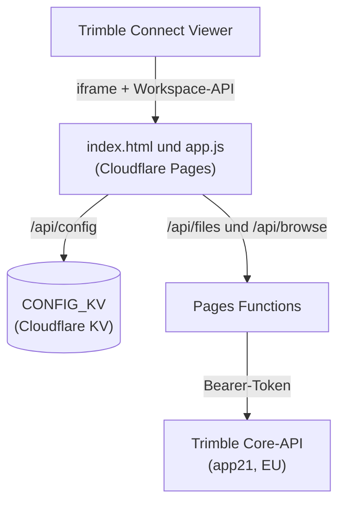
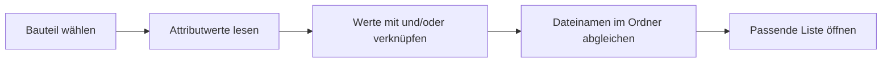

# Dokumenten-Verknüpfer

> Trimble Connect Extension, die Bauteile im 3D-Modell mit den zugehörigen Listen und Dokumenten im Projektordner verbindet.


-blue)


Klickst du im Modell ein Bauteil an, liest die Extension ein konfiguriertes Attribut aus (den Schlüssel, zum Beispiel eine Stahllisten-Nummer), sucht im hinterlegten Ordner die passende Datei und öffnet sie. Ohne Auswahl zeigt sie alle im Modell vorkommenden Listen. Entwickelt für die Baustelle (Polier, Bauführer).

## Inhalt

- [Funktionen](#funktionen)
- [Wie es funktioniert](#wie-es-funktioniert)
- [Projektstruktur](#projektstruktur)
- [Deployment auf Cloudflare Pages](#deployment-auf-cloudflare-pages)
- [Konfiguration](#konfiguration)
- [API-Endpunkte](#api-endpunkte)
- [Entwicklung und Tests](#entwicklung-und-tests)
- [Sicherheit](#sicherheit)
- [Vor dem Produktiveinsatz verifizieren](#vor-dem-produktiveinsatz-verifizieren)
- [Roadmap](#roadmap)
- [Lizenz und Kontakt](#lizenz-und-kontakt)

## Funktionen

- **Bauteil zu Liste:** Auswahl im Modell zeigt direkt die passende Datei zum Öffnen.
- **Modell-Übersicht:** Ohne Auswahl erscheinen alle Listen, die im geladenen Modell vorkommen, mit Suchfeld und Änderungsdatum.
- **Im Modell wählen:** Ein Knopf wählt die zu einer Liste gehörenden Bauteile im 3D-Modell an und zoomt darauf.
- **Mehrere Schlüssel-Attribute:** Bis zu drei Attribute pro Regel, je Zeile mit „und" oder „oder" verknüpft. So lässt sich nach mehreren Werten im Dateinamen suchen.
- **Projekt-Vorgabe plus persönliche Überschreibung:** Ein Projekt-Admin setzt eine Vorgabe für alle. Jeder Benutzer kann sie für sich überschreiben und wieder zurücksetzen.
- **Abgleich und Filter:** exakt oder „enthält", Dateityp-Filter (PDF, ABS, Word, Excel) und Überspringen von Archiv- und Alt-Ordnern.
- **Float-Normalisierung:** Zahlen mit Rauschen wie `14.129999999999999` werden auf die im Modell übliche Genauigkeit gebracht, damit sie zum Dateinamen passen.
- **Automatische Versionsanzeige:** Bei einem neuen Deploy erscheint oben ein Hinweis „Neue Version verfügbar" mit „Neu laden".

## Wie es funktioniert

Frontend und Functions liegen auf derselben Cloudflare-Pages-Domain, darum braucht es zwischen ihnen kein CORS. Die Functions sprechen mit der Trimble Core-API und reichen das Bearer-Token des Benutzers durch. Gespeichert wird nur die Konfiguration je Projekt, keine Modell- oder Dateiinhalte.



Ablauf zur Laufzeit:



## Projektstruktur

```
index.html                            Frontend: Laufzeit, Konfig, Hilfe, Über (läuft im Trimble-iframe)
app.js                                Frontend-Logik: Modell-Scan, Matching, Konfig-UI, Update-Hinweis
icon.svg                              Icon
manifest.json                         Extension-Manifest (URL in Trimble eintragen)
_headers                              Sicherheits-Header, CSP (Report-Only), Cache-Regeln
build.sh                              erzeugt version.json beim Build (Commit-Hash)
wrangler.toml                         Pages-Konfig: KV-Binding CONFIG_KV und CORE_API_BASE
functions/api/config/[projectId].js   Konfig lesen/speichern: Vorgabe, Überschreibung, Admin-Prüfung
functions/api/files.js                rekursive Dateiliste eines Ordners (Core-API-Proxy)
functions/api/browse.js               Ordner-Browser für die Konfig-UI (Core-API-Proxy)
test/                                 Inline-Tests (Node): config, matching, version
```

## Deployment auf Cloudflare Pages

1. **KV anlegen**

   ```bash
   npx wrangler kv namespace create CONFIG_KV
   ```

   Die ausgegebene `id` in `wrangler.toml` eintragen.

2. **Region-Host setzen**

   In `wrangler.toml` `CORE_API_BASE` auf den Region-Host eures Projekts setzen. Projekte in der Schweiz und EU liegen nicht auf dem NA-Master, sondern auf `app21.connect.trimble.com`.

3. **Deployen**

   ```bash
   npx wrangler pages deploy .
   ```

   Oder das Git-Repo im Pages-Dashboard verbinden. Build Output Directory bleibt `.`.

4. **Build command für die Versionsanzeige**

   Im Pages-Dashboard unter Settings, Build and deployments das Build command auf `bash build.sh` setzen. `build.sh` schreibt bei jedem Deploy `version.json` mit dem Commit-Hash (`CF_PAGES_COMMIT_SHA`). Daraus liest das Frontend die Version. Ohne gesetztes Build command fehlt `version.json` einfach, die App läuft normal weiter.

5. **Manifest anpassen**

   In `manifest.json` `url` und `icon` auf eure Pages-Domain setzen (`https://<name>.pages.dev/...`).

6. **Extension in Trimble installieren**

   Projekt-Einstellungen, Extensions, Manifest-URL eintragen (`https://<name>.pages.dev/manifest.json`).

## Konfiguration

Konfiguriert wird in der Extension über das Zahnrad. Gespeichert wird je Projekt im KV.

### Zwei Ebenen

| Ebene | KV-Schlüssel | Wer schreibt |
|---|---|---|
| Projekt-Vorgabe | `cfg:{projectId}` | nur Projekt-Admins (`scope=project`) |
| Persönliche Überschreibung | `cfg:{projectId}:user:{userId}` | jeder Benutzer (`scope=user`) |

Wirksam (`effective`) ist die Überschreibung, sonst die Vorgabe. Die `userId` und die Admin-Rolle werden serverseitig aus dem Token und der Core-API abgeleitet, nie vom Client übernommen. Verifiziert: `GET /users/me` liefert die User-GUID im Feld `id`, `GET /projects/{id}/users` liefert die Rollen, Admin ist `role` gleich `ADMIN`.

### Regel-Format

```json
{
  "projectId": "2225016",
  "rules": [
    {
      "keys": [
        { "pset": "AllplanAttributes", "attribute": "Stahllistennummer", "op": "and" },
        { "pset": "AllplanAttributes", "attribute": "Position", "op": "or" }
      ],
      "pset": "AllplanAttributes",
      "attribute": "Stahllistennummer",
      "targetFolderId": "abc...",
      "targetFolderName": "Projekt / ... / 03_Bestelllisten",
      "matchMode": "exact",
      "fileType": "all",
      "skipArchive": "1"
    }
  ]
}
```

- `keys`: ein bis drei Schlüssel-Attribute. Das erste Attribut wird zusätzlich in `pset` und `attribute` gespiegelt, damit ältere Konfigurationen ohne `keys` weiterlaufen.
- `op`: `and` oder `or`, von links nach rechts ausgewertet. Beim ersten Eintrag ohne Bedeutung.
- `matchMode`: `exact` (Dateiname gleich Attributwert ohne Endung) oder `contains`. Bei mehreren Attributen gilt pro Wert `enthält`.
- `fileType`: `all`, `pdf`, `abs`, `word`, `excel`.
- `skipArchive`: `1` überspringt Ordner wie alt, archiv, old, backup.

## API-Endpunkte

Alle Endpunkte erwarten `Authorization: Bearer <trimble-token>` und prüfen serverseitig die Projektmitgliedschaft.

| Methode | Pfad | Zweck |
|---|---|---|
| GET | `/api/config/{projectId}` | liefert `{ default, override, effective, isAdmin }` |
| PUT | `/api/config/{projectId}?scope=user\|project` | speichert Überschreibung oder Vorgabe (Projekt nur als Admin, sonst 403) |
| DELETE | `/api/config/{projectId}?scope=user` | löscht die eigene Überschreibung |
| GET | `/api/files?folderId=...&skipArchive=1` | flache, rekursive Dateiliste eines Ordners |
| GET | `/api/browse?projectId=...` oder `?folderId=...` | listet Unterordner für den Ordner-Browser |

Eingaben werden serverseitig auf eine Feld-Whitelist beschränkt, in der Grösse begrenzt und normalisiert.

## Entwicklung und Tests

Es gibt keinen Build-Schritt fürs Frontend. Bearbeite `index.html`, `app.js` und die Functions direkt.

Die Tests laufen ohne Abhängigkeiten mit Node 18 oder neuer (globales `fetch`, `Response`, `vm`). Sie nutzen ein gemocktes KV, ein gestubbtes `fetch` und für das Frontend eine `vm`-Sandbox.

```bash
node test/config.test.mjs     # Konfig-Endpunkt: Vorgabe/Überschreibung, Admin, keys-Normalisierung
node test/matching.test.mjs   # Matching-Engine: Mehrfach-Attribute, und/oder, Float-Normalisierung
node test/version.test.mjs    # Versionsanzeige und Update-Hinweis
```

## Sicherheit

- Keine Geheimnisse im Code. Das Token lebt nur im Speicher und im Authorization-Header.
- `userId` und Admin-Rolle werden immer serverseitig abgeleitet, nie aus dem Client übernommen.
- Sicherheits-Header in `_headers`, inklusive einer Content-Security-Policy im Report-Only-Modus. Das Frontend nutzt nur Same-Origin-Aufrufe und bindet Ereignisse per `addEventListener`, ohne Inline-Handler.

## Vor dem Produktiveinsatz verifizieren

1. **CORE_API_BASE (Region):** Die Core-API ist regions-spezifisch. Schweiz und EU liegen auf `app21`, nicht auf dem NA-Master `app.connect.trimble.com`. Korrekten Region-Host in `wrangler.toml` eintragen.
2. **Ordner-Items-Endpunkt:** `functions/api/files.js` nutzt `GET /folders/{id}/items`. Gegen die offizielle Spec abgleichen: <https://developer.trimble.com/docs/connect/core-api/>. Der Proxy normalisiert die Antwort defensiv (id, name, type).

## Roadmap

- Datei-Vorschau oder Download im Panel statt Öffnen in neuem Tab.
- Mehrere Regeln je Bauteiltyp (das Datenmodell `rules[]` ist schon darauf ausgelegt).
- Fallback-Mapping-Tabelle für unsaubere Modell-Attribute.

### Datenqualität

Entscheidend ist, dass das gewählte Attribut einen brauchbaren, eindeutigen Schlüssel enthält (nicht „ja/vorhanden") und die Dateinamen einer Konvention folgen. Wo das nicht gegeben ist, hilft eine Mapping-Tabelle.

> **Hinweis:** Eine Inhaltssuche im PDF ist mit Trimble Connect nicht möglich. Such-API und Browser-Suche indexieren Namen und Metadaten, nicht den Text in der Datei.

## Lizenz und Kontakt

Lizenziert durch die Anliker AG. Die Nutzung ist Anliker AG und berechtigten Projektbeteiligten vorbehalten. Eine Weitergabe oder Verwendung ausserhalb dieses Rahmens ist ohne Zustimmung der Anliker AG nicht gestattet.

Entwickelt von Team DBA, Digitales Bauen, Anliker AG. Fragen, Fehler oder Wünsche an <dba@anliker.ch>.
